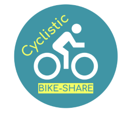
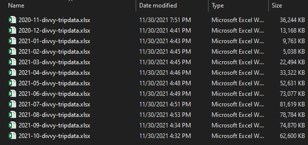
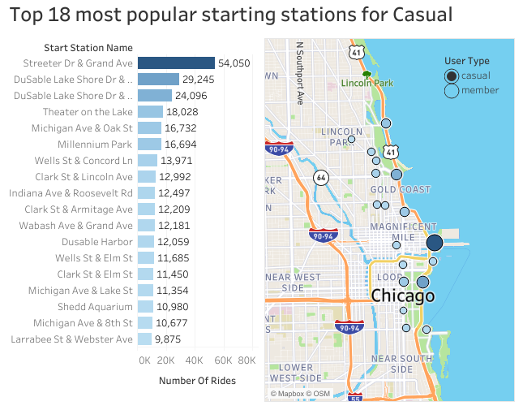
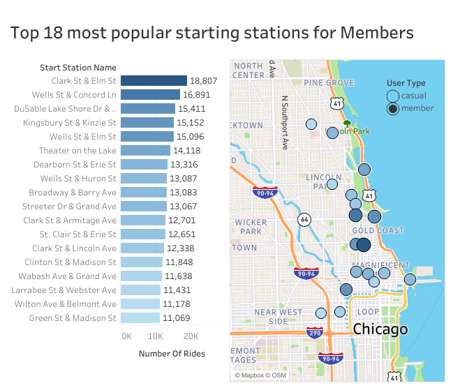
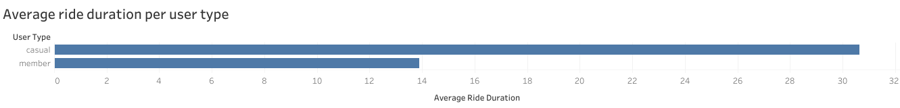

# Google Data Analytics Professional Certificate Capstone project

## Report on how annual members and casual riders use Cyclistic bikes differently

### Foreword

I am Joao L. F. Kuanga, also known as John_The_Analyst, a
result-oriented professional with a degree in Business Management, where
I acquired concepts and techniques in Financial control, budgeting,
strategic planning, and experience in carrying out analytical work and
research projects. Furthermore, I am a Google-certified data analyst
with an excellent understanding and proficiency of platforms for
effective data analyses, including SQL, Excel, Tableau, and R.

## Table of Contents
* [Introduction](#Introduction)
* [Ask: A clear statement of the business task](#Ask-a-clear-statement-of-the-business-task-)
* [Data preparation: A description of all data sources used](#Data-preparation-a-description-of-all-data-sources-used-)
* [Data processing: Documentation of any cleaning or manipulation of data](#Data-processing-documentation-of-any-cleaning-or-manipulation-of-data-)
* [Analysis & Share: A summary analysis and key findings with Supporting visualizations](#Analysis-Share-a-summary-analysis-and-key-findings-with-supporting-visualizations-)
* [Act: Conclusion and top three recommendations based on my analysis](#Act-conclusion-and-top-three-recommendations-based-on-my-analysis-)

### Introduction

This is my report on the Capstone Project of Google Data Analytics
Professional Certificate. In this case study, I am working as a junior
data analyst in the marketing analyst team at Cyclistic, a fictional
bike-share company in Chicago. The company features 5,824 bicycles and
692 docking stations across Chicago. Cyclistic's customers are
classified into those who purchase single-ride or full-day passes,
referred to as casual riders, and those who purchase annual memberships,
referred to as Cyclistic members, who are considerably more profitable
according to Cyclistic's Financial Analyst's conclusion. The purpose of
this report, therefore, is to understand how casual riders and annual
members use Cyclistic bikes differently. Based on those insights,
recommendations will be made that provide guidance for Cyclistic's
marketing strategy with the goal of converting casual riders into annual
members.

The following steps of the data analysis process will be applied with
compelling data insights and professional data visualization: ask,
prepare, process, analyze, share, and act. Then, conclusions and
recommendations based on Lily Moreno's (Director of Marketing)
assumption that "Cyclistic's future success depends on maximizing the
number of annual memberships" will follow. The tools used for this
report are R and Tableau Public.

### Ask: A clear statement of the business task <a name="Ask"></a>

Until now, Cyclistic's marketing strategy relied on building general
awareness and appealing to broad consumer segments, providing flexible
pricing plans, which was very successful in creating a good customer
base. In order to continue growing, a new strategy is needed to maximize
the current profits, and contrary to the old strategy, the director of
marketing intends to target Cyclistic's casual riders to convert them
into members. The main objective of this project is profit maximization,
which is also the stakeholders' main expectation. Thus, it is expected
to be attained through customer behaviour analysis, leading to a
marketing strategic plan.

The following are the stakeholders of the project:

-   Lily Moreno (Director of Marketing) responsible for the development
    of campaigns and initiatives to promote the bike-share program,

-   The Cyclistic executives who will decide whether to approve the
    recommended marketing program/campaign, and

-   Cyclistic marketing analytics team, which I am part of.

The following three questions will guide the future marketing program:

1.  How do annual members and casual riders use Cyclistic bikes
    differently?
2.  Why would casual riders buy Cyclistic annual memberships?
3.  How can Cyclistic use digital media to influence casual riders to
    become members?

As mentioned above, Lilly Moreno has assigned me the first question to
answer: How do annual members and casual riders use Cyclistic bikes
differently? Thus, this report will exclusively cover question number 1.

### Data preparation: A description of all data sources used <a name="Data"></a>

For the purposes of this case study, the data has been made available by
Motivate International Inc. under this
[license](www.divvybikes.com/data-license-agreement) to be considered as
Cyclistic's historical trip data.

The previous 12 months of Cyclistic's trip data will be used to analyze
and identify trends from 1 November 2020 to 30 October 2021. The data
lives inside the company's own systems and is stored in CSV files. Each
file contains one month's data. Thus, a total of 12 .csv files will be
analyzed. Being internal data, it is more reliable in terms of bias or
credibility. It is up-to-date and relevant. Therefore, we can conclude
that the data in use is Reliable, Original, Comprehensive, Current and
Cited (ROCC).

#### Data Organization

After downloading, the files are unzipped. A folder on the desktop to
house the files is created. Using appropriate file-naming conventions,
the file names are edited. Sub-folders for the .CSV and the .XLSX file
are created and the downloaded .CSV files are also saved as an Excel
Workbook file to the appropriate sub-folder, so that an original copy of
the data is kept after the manipulation or cleaning process.

The following figure shows the xlsx-files:



There are **13 columns** (variables) in each xlsx file. Metadata is not
provided but most of the variables are self-explanatory:

1.  `ride_id`

2.  `rideable_type`

3.  `started_at`

4.  `ended_at`

5.  `start_station_name`

6.  `start_station_id`

7.  `end_station_name`

8.  `end_station_id`

9.  `start_lat`

10. `start_lng`

11. `end_lat`

12. `end_lng`

13. `member_casual`

Two variables need to be clarified:

2)  `rideable_type` - there are three possible values for this variable:
    `classic_bike`,`docked_bike`, and `electric_bike`. `classic_bike` is
    a classic dock-less bike, `docked_bike` is a classic docked bike,
    and `electric_bike` is an e-bike that can be either docked at any
    station or locked with cable at any e-station for no additional
    cost. For an extra \$2, it is possible to lock a bike to any public
    bike rack, light pole, signpost, or retired parking meter outside of
    a station within the service area.

3)  `member_casual` - there are two possible values for this variable:
    `casual` and `member`, representing casual riders and annual
    members. Casual riders buy a Single Ride Pass (\$3.30 for one trip
    up to 30 minutes with extra fees if taken longer), or a Day Pass
    (\$15 for unlimited 3-hour rides in a 24-hour period with extra fees
    if taken longer), while members buy Annual Membership (\$9/month,
    i.e. \$108 billed upfront annually, for unlimited 45-min rides with
    extra fees if taken longer).

#### Limitations

The data-privacy issues prohibit us from using riders' personally
identifiable information. This means that we will not be able to connect
pass purchases to credit card numbers to determine if casual riders live
in the Cyclistic service area or if they have purchased multiple single
passes.

#### Setting up the environment

Setting up the environment by loading the following packages:

```{r, message=FALSE, results='hide'}
library(tidyverse)
library(lubridate)
library(janitor)
library(skimr)
library(DataExplorer)
library(readxl)
library(rpivotTable)
library(dlookr)
```

Importing data and assigning the correct data type:

```{r}
nov_2020 <- read_excel("2020-11-divvy-tripdata.xlsx", col_types = c("text", "text", "date", 
                                                                    "date", "text", "text", "text", "text", 
                                                                    "numeric", "numeric", "numeric", 
                                                                    "numeric", "text"))
dec_2020 <- read_excel("2020-12-divvy-tripdata.xlsx", col_types = c("text", "text", "date", 
                                                                    "date", "text", "text", "text", "text", 
                                                                    "numeric", "numeric", "numeric", 
                                                                    "numeric", "text"))
jan_2021 <- read_excel("2021-01-divvy-tripdata.xlsx", col_types = c("text", "text", "date", 
                                                                    "date", "text", "text", "text", "text", 
                                                                    "numeric", "numeric", "numeric", 
                                                                    "numeric", "text"))
feb_2021 <- read_excel("2021-02-divvy-tripdata.xlsx", col_types = c("text", "text", "date", 
                                                                    "date", "text", "text", "text", "text", 
                                                                    "numeric", "numeric", "numeric", 
                                                                    "numeric", "text"))
mar_2021 <- read_excel("2021-03-divvy-tripdata.xlsx", col_types = c("text", "text", "date", 
                                                                    "date", "text", "text", "text", "text", 
                                                                    "numeric", "numeric", "numeric", 
                                                                    "numeric", "text"))
apr_2021 <- read_excel("2021-04-divvy-tripdata.xlsx", col_types = c("text", "text", "date", 
                                                                    "date", "text", "text", "text", "text", 
                                                                    "numeric", "numeric", "numeric", 
                                                                    "numeric", "text"))
may_2021 <- read_excel("2021-05-divvy-tripdata.xlsx", col_types = c("text", "text", "date", 
                                                                    "date", "text", "text", "text", "text", 
                                                                    "numeric", "numeric", "numeric", 
                                                                    "numeric", "text"))
jun_2021 <- read_excel("2021-06-divvy-tripdata.xlsx", col_types = c("text", "text", "date", 
                                                                    "date", "text", "text", "text", "text", 
                                                                    "numeric", "numeric", "numeric", 
                                                                    "numeric", "text"))
jul_2021 <- read_excel("2021-07-divvy-tripdata.xlsx", col_types = c("text", "text", "date", 
                                                                    "date", "text", "text", "text", "text", 
                                                                    "numeric", "numeric", "numeric", 
                                                                    "numeric", "text"))
aug_2021 <- read_excel("2021-08-divvy-tripdata.xlsx", col_types = c("text", "text", "date", 
                                                                    "date", "text", "text", "text", "text", 
                                                                    "numeric", "numeric", "numeric", 
                                                                    "numeric", "text"))
sep_2021 <- read_excel("2021-09-divvy-tripdata.xlsx", col_types = c("text", "text", "date", 
                                                                    "date", "text", "text", "text", "text", 
                                                                    "numeric", "numeric", "numeric", 
                                                                    "numeric", "text"))
oct_2021 <- read_excel("2021-10-divvy-tripdata.xlsx", col_types = c("text", "text", "date", 
                                                                    "date", "text", "text", "text", "text", 
                                                                    "numeric", "numeric", "numeric", 
                                                                    "numeric", "text"))

```

Confirming that the set of dataframes are row-bindable. The following
function returns TRUE if there are no mismatching rows:

```{r}
compare_df_cols_same(nov_2020, dec_2020, jan_2021, feb_2021, mar_2021, apr_2021, 
                     may_2021, jun_2021, jul_2021, aug_2021, sep_2021, oct_2021,
  bind_method = c("bind_rows", "rbind"),
  verbose = TRUE
)
```

The columns are proved to be consistent, so the next step is to merge
them into a single dataframe:

```{r}
trips_data <- bind_rows(nov_2020, dec_2020, jan_2021, feb_2021, mar_2021, apr_2021, 
                                 may_2021, jun_2021, jul_2021, aug_2021, sep_2021, oct_2021)
```

Now the data is ready for clean-up. The following is a glimpse of the
data:

```{r}
glimpse(trips_data)
```

```{r}
introduce(trips_data)
```

### Data processing: Documentation of any cleaning or manipulation of data <a name="Processing"></a>

#### Creation of new columns:

1.  `ride_duration` in minutes, converted to numeric data type and
    rounded to 2 decimal places

```{r}
trips_data$ride_duration <- difftime(trips_data$ended_at, trips_data$started_at, units="mins")
```

```{r}
trips_data$ride_duration <- round(as.numeric(trips_data$ride_duration),2)
```

2.  `day_of_week`

```{r}
trips_data$day_of_week <- wday(trips_data$started_at, label = TRUE, abbr = FALSE, week_start = getOption("lubridate.week.start", 1))
```

3.  `year_month`, converted to factor data type

```{r}
trips_data$year_month <- factor(format(as.Date(trips_data$started_at), "%Y-%m"))
```

4.  `starting_hour`, converted to factor data type

```{r}
trips_data$starting_hour <- factor(hour(trips_data$started_at))
```

#### Renaming existing columns meaningfully:

List of existing column names

```{r}
colnames(trips_data)
```

1.  Renaming `rideable_type` to `bike_type`

```{r}
trips_data <- trips_data %>% 
  rename(bike_type = rideable_type)
```

2.  Renaming `member_casual` to `user_type`

```{r}
trips_data <- trips_data %>% 
  rename(user_type = member_casual)
```

#### Re-coding docked_bike to classic_bike:

```{r}
ftable(trips_data$user_type, trips_data$year_month, trips_data$bike_type)
```

```{r}
trips_data %>%
  group_by(bike_type) %>% 
  summarise(total_rides = n()) %>% 
  mutate(percentage = total_rides/sum(total_rides)*100)
```

In November 2020, there were only two bike_types: the docked_bike and
the electric_bike. In December 2020, a new `bike_type` was introduced in
the data: the classic_bike. Since the beginning of 2021, only casual
riders have used docked bikes. Based on research and given the knowledge
of the business, there are only 2 bike categories: electric_bike and
classic_bike. One can learn more
[here](https://divvybikes.com/how-it-works/meet-the-bikes).
`classic_bike` is actually a classic dock-less bike, `docked_bike` is a
classic docked bike. Therefore, I conclude to re-code docked_bike to
classic_bike in order to summarize both types of classic bikes under one
category.

The case study provides the following information: "Cyclistic sets
itself apart by also offering reclining bikes, hand tricycles, and cargo
bikes, making bike-share more inclusive to people with disabilities and
riders who can't use a standard two-wheeled bike. The majority of riders
opt for traditional bikes; about 8% of riders use the assistive
options".

In the data, docked_bikes represent about 8% of the rides. According to
the case study assistive options also make up roughly 8% of the rides.
Nonetheless, there is not enough evidence to conclude that all
docked_bikes are assistive options.

```{r}
trips_data_v1 <- trips_data %>% 
  mutate(bike_type = recode(bike_type, "docked_bike" = "classic_bike"))
```

verification:

```{r}
trips_data_v1 %>%
  count(bike_type)
```

#### Inspecting the dataframe

```{r}
head(trips_data_v1)
```

```{r}
skim_without_charts(trips_data_v1)
```

By observing the data summary we can notice the following problems that
need to be addressed:

-   The number of unique `ride_id` does not match the number of rows,
    which indicates that there is some duplicated rows based on the
    `ride_id`.

-   It does not make sense to have negative `ride_duration` or numbers
    less than 1 minute.

-   There are missing values (NA) in the `start_station_name`,
    `start_station_id`, `end_station_name`, end_station_id, `end_lat`
    and `end_lng` columns.

#### Removing duplicates based on ride_id

Each row represents one observation/trip, there is a total of 5,378,834
rows, but only 5,378,625 unique `ride_id` values, meaning there are 209
rows of duplicated data to be removed.

```{r}
trips_data_v2 <- trips_data_v1[!duplicated(trips_data_v1$ride_id), ]
```

verification:

```{r}
nrow(trips_data_v1) - nrow(trips_data_v2)
```

#### Given the business knowledge, the following bullet-points should be removed:

-   Trips with negative `ride_duration` (the end of the trip precedes
    the start)

```{r}
trips_data_v2 %>%
  count(ride_duration <= 0)
```

-   Trips with `ride_duration` between 0 and 1 min (potentially false
    starts or users trying to re-dock a bike to ensure it was secure)

```{r}
trips_data_v2 %>%
  count(ride_duration >= 0 & ride_duration < 1)
```

-   Trips associated with Divvy test and repair stations

Inspecting for uniqueness in `start_station_name`

```{r, results='hide', message=FALSE, include=FALSE}
unique(trips_data_v2$start_station_name)
```

Creating a vector of the station names associated with Divvy test and
repair stations

```{r}
test_and_repair_stations <- c("Base - 2132 W Hubbard Warehouse",
              "DIVVY CASSETTE REPAIR MOBILE STATION",
              "HUBBARD ST BIKE CHECKING (LBS-WH-TEST)",
              "WATSON TESTING - DIVVY",
              "WEST CHI-WATSON")
```

Inspecting for uniqueness in `end_station_id`

```{r, results='hide', include=FALSE}
unique(trips_data_v2$end_station_id)
```

Creating a vector of the station ids associated with Divvy test and
repair stations

```{r}
test_and_repair_stations_id <- c("DIVVY 001",
            "DIVVY CASSETTE REPAIR MOBILE STATION",
            "Hubbard Bike-checking (LBS-WH-TEST)")
```

Finally removing the above-mentioned trips:

```{r}
trips_to_remove <- trips_data_v2 %>%
  filter(start_station_name %in% test_and_repair_stations |
           end_station_name %in% test_and_repair_stations |
           start_station_id %in% test_and_repair_stations_id |
           end_station_id %in% test_and_repair_stations_id |
           ride_duration <1)
```

Number of trips to be removed

```{r}
nrow(trips_to_remove)
```

```{r}
trips_data_v2 <- setdiff(trips_data_v2, trips_to_remove)
```

Number of trips left

```{r}
nrow(trips_data_v2)
```

#### Inspecting closely the observations with missing values (NA)

```{r, fig.align='center'}
plot_missing(trips_data_v2)
```

Create a NA dataframe for a close look of the data and further
evaluation

```{r}
trips_data_NA <- trips_data_v2 %>% 
  filter(is.na(start_station_name) | 
           is.na(end_station_name) | 
           is.na(start_station_id) | 
           is.na(end_station_id) |
           is.na(end_lat) |
           is.na(end_lng))
```

Removing trips with no `end_lat` and `end_lng` and no `end_station`
name/id (considered as lost or stolen)

```{r}
trips_to_remove_1 <- trips_data_v2 %>%
       filter(is.na(end_station_name) & 
                is.na(end_station_id) &
                is.na(end_lat) &
                is.na(end_lng))
```

```{r}
trips_data_v2 <- setdiff(trips_data_v2, trips_to_remove_1)
```

Summary of retained missing values

```{r}
trips_data_keptNA <- trips_data_v2 %>% 
  filter(is.na(start_station_name) | 
           is.na(end_station_name) | 
           is.na(start_station_id) | 
           is.na(end_station_id) |
           is.na(end_lat) |
           is.na(end_lng))
```

```{r}
table(trips_data_keptNA$year_month, trips_data_keptNA$user_type)
```

There may be various reasons for missing values, such as system
malfunction.

#### Checking if any station has changed its name at some point

After some research, I found out that in July 2021 Chicago renamed the
iconic Lake Shore Drive to honour its city's 'founder' Jean Baptiste
Point DuSable. It is now known as DuSable Lake Shore Drive. You can read
the story
[here](https://abc7chicago.com/lake-shore-drive-dusable-rename-chicago-jean-baptiste-point-du-sable/10831970/).
I, thus, re-code old station names in the start_station_name column with
the new ones. This step is necessary in order to get an accurate list of
the most popular stations.

```{r}
trips_data_v2 %>% 
  group_by(start_station_id, year_month) %>%
  summarise(n_distinct_start_station_name = n_distinct(start_station_name), .groups = 'drop') %>% 
  filter(n_distinct_start_station_name > 1)
```

```{r}
start_st_id <- c("13074", "13099", "13221", "13300", "20215", "331", "351", "503", "625", "631", "E011", "LF-005", "TA1305000039", "TA1306000029", "TA1307000041","TA1309000039", "TA1309000049")
```

```{r}
trips_data_v2 %>%
  filter(start_station_id %in% start_st_id) %>% 
  group_by(start_station_id, start_station_name) %>%
  summarise(min_datetime = min(started_at), max_datetime = max(started_at), count = n(), .groups = 'drop' ) %>% 
  arrange(start_station_id, min_datetime)
```

Re-coding the following stations' names

```{r}
trips_data_v2 <- trips_data_v2 %>% 
  mutate(start_station_name = recode(start_station_name, 
                                     "Broadway & Wilson Ave" = "Broadway & Wilson - Truman College Vaccination Site",
                                     "Halsted St & 18th St" = "Halsted St & 18th St (Temp)",
                                     "Lake Shore Dr & Monroe St" = "DuSable Lake Shore Dr & Monroe St",
                                     "Chicago Ave & Dempster St" = "Dodge Ave & Main St",
                                     "Halsted St & Clybourn Ave" = "Pulaski Rd & 21st St",
                                     "Drake Ave & Fullerton Ave" = "St. Louis Ave & Fullerton Ave",
                                     "Malcolm X College" = "Malcolm X College Vaccination Site",
                                     "Lake Shore Dr & North Blvd" = "DuSable Lake Shore Dr & North Blvd",
                                     "Marshfield Ave & Cortland St" = "Elston Ave & Cortland St",
                                     "Lake Shore Dr & Ohio St" = "DuSable Lake Shore Dr & Ohio St",
                                     "Lake Shore Dr & Wellington Ave" = "DuSable Lake Shore Dr & Wellington Ave",
                                     "Lake Shore Dr & Diversey Pkwy" = "DuSable Lake Shore Dr & Diversey Pkwy",
                                     "Lake Shore Dr & Belmont Ave" = "DuSable Lake Shore Dr & Belmont Ave"))

```

Repeating the previous step for the `end_station_name` column

```{r}
trips_data_v2 <- trips_data_v2 %>% 
  mutate(end_station_name = recode(end_station_name, 
                                     "Broadway & Wilson Ave" = "Broadway & Wilson - Truman College Vaccination Site",
                                     "Halsted St & 18th St" = "Halsted St & 18th St (Temp)",
                                     "Lake Shore Dr & Monroe St" = "DuSable Lake Shore Dr & Monroe St",
                                     "Chicago Ave & Dempster St" = "Dodge Ave & Main St",
                                     "Halsted St & Clybourn Ave" = "Pulaski Rd & 21st St",
                                     "Drake Ave & Fullerton Ave" = "St. Louis Ave & Fullerton Ave",
                                     "Malcolm X College" = "Malcolm X College Vaccination Site",
                                     "Lake Shore Dr & North Blvd" = "DuSable Lake Shore Dr & North Blvd",
                                     "Marshfield Ave & Cortland St" = "Elston Ave & Cortland St",
                                     "Lake Shore Dr & Ohio St" = "DuSable Lake Shore Dr & Ohio St",
                                     "Lake Shore Dr & Wellington Ave" = "DuSable Lake Shore Dr & Wellington Ave",
                                     "Lake Shore Dr & Diversey Pkwy" = "DuSable Lake Shore Dr & Diversey Pkwy",
                                     "Lake Shore Dr & Belmont Ave" = "DuSable Lake Shore Dr & Belmont Ave"))

```

Creation of a new version for analysis

```{r}
trips_data_v3 <- trips_data_v2
```

### Analysis & Share: A summary analysis and key findings with Supporting visualizations <a name="Analysis"></a>

```{r}
diagnose(trips_data_v3)
```

#### Number of rides

-   Total rides per month by user type

```{r}
total_rides_per_month <- trips_data_v3 %>%
  group_by(user_type, year_month) %>% 
  summarise(total_rides = n(), .groups = 'drop') %>% 
  mutate(percentage = total_rides/sum(total_rides)*100)
```

Plot

```{r, fig.width=9}

ggplot(data = total_rides_per_month, mapping =  aes(x = year_month, y = total_rides, fill = user_type)) + 
  geom_col(color = "black", position = "dodge", width = 0.6) + 
  scale_y_continuous(labels = scales::comma) +
  scale_fill_manual(values = c("purple", "#7E9BB4FF")) +
  ylab("Number of rides") + 
  xlab("Month of the year") +
  ggtitle("Total Rides Per Month By User Type", subtitle = "November 2020 - October 2021 (1 year)") +
  theme_minimal()
```

[](https://weatherspark.com/y/14091/Average-Weather-in-Chicago-Illinois-United-States-Year-Round)

Analysis: Mid-November to early January is the holiday season in
Chicago, meaning there are fewer people commuting to and from work.
Furthermore, the cold season lasts for 3.2 months, from December 2 to
March 9, with an average daily high temperature below 43?F. In
accordance with this, the months from December to March have the lowest
number of rides of the year.

The busiest times in terms of tourism in Chicago are: mid-March to
mid-April (for St. Patrick's Day and spring break), and summer (from
Memorial Day to Labor Day). Therefore, there is a sudden increase in the
number of rides from March, reaching its peak in July for being the
the hottest month of the year, with an average high of 82?F and a low of 70?F.

The number of rides throughout the year correlates with the weather and
[Covid-19](https://www.chicago.gov/city/en/sites/covid-19/home/covid-dashboard.html)
number of Cases. Although there are more Member rides than Casual rides,
we can say that both Casual and Members rode less in winter. The only
months with more Casual rides than Members are June, July and August.
This tells us that casual riders prefer riding in summer and are more
touristic riders riding for leisure, while annual members also prefer
riding in summer but are more regular and local riders commuting to work
and doing daily activities.

-   Total rides per day of the week by user type

```{r, message=FALSE}
total_rides_per_day_of_week <- trips_data_v3 %>%
  group_by(user_type, day_of_week) %>% 
  summarise(total_rides = n()) %>% 
  mutate(percentage = total_rides/sum(total_rides)*100)
```

Plot

```{r}

ggplot(total_rides_per_day_of_week, aes(x = day_of_week, y = total_rides, fill = user_type)) + 
  geom_col(colour = "black", width = 0.6, position = "dodge") + 
  scale_y_continuous(labels = scales::comma) +
  scale_fill_manual(values = c("purple", "#7E9BB4FF")) +
  ylab("Number of rides") + 
  xlab("Day of the week") +
  ggtitle("Total Rides Per Day of The Week By User Type", subtitle = "November 2020 - October 2021 (1year)") +
  theme_minimal()
```

Analysis: From Monday to Friday there are more Member rides than Casual
rides. There is a significant increase of casual rides on Friday but
only Saturday and Sunday are the days of the week on which there are
more Casual rides than Members. Saturday has the highest number of
casual rides with 22,34%, followed by Sunday with 19,27%, compared to
14,46% and 12,65% of members respectively. About 58% of casual rides and
73% of members' rides take place during the week.

The data in this graph shows that most casual riders prefer riding on
the weekends, confirming that they are majorly touristic riders, and on
the other hand it shows that members are mostly regular riders riding
mostly during the week, for example commuting to work and doing daily
activities. However, some members also enjoy riding on the weekends for
leisure and or work, as it is evident that there is no significant
difference in the percentage of rides during the week and weekend.

-   Total rides per hour

```{r, message=FALSE}
total_rides_per_st_hour <- trips_data_v3 %>%
  group_by(user_type, starting_hour) %>% 
  summarise(total_rides = n()) %>% 
  mutate(percentage = total_rides/sum(total_rides)*100)
```

Plot

```{r}

ggplot(total_rides_per_st_hour, aes(x = starting_hour, y = total_rides, color = user_type, group = user_type)) +
  geom_line(size=1.2) +
  scale_y_continuous(labels = scales::comma) +
  scale_color_manual(values = c("purple", "#7E9BB4FF")) +
  ylab("Number of rides") +
  xlab("Starting hours") +
  ggtitle("Total Rides Per Starting Hour By User Type", subtitle = "November 2020 - October 2021 (1year)") +
  theme_bw()
```

Analysis: The standard business hours in the Loop are 8am-5pm local
time. 5-5:30pm is the time when most people walk to a train/bus or take
a ride home after the working day is over.

About 14% of all Members' rides take place from 7 am to 9 am, 16% from 11 am
to 1 pm and 27% from 4 pm to 6 pm, with 5 pm being the peak. This indicates
that most members are local riders, who use bikes to commute to work,
school and home, to run errands, or do other daily life activities.

The graph shows that about 25% of all casual rides take place at 4 pm to
6 pm, with 5 pm being the peak. 1 pm to 2 pm is the only time that there are
more casual rides than members ride. This indicates that some casual
riders are also locals who commute home from school, work etc., but that
most casual riders are touristic riders who take rides mostly in the
afternoon and stop taking rides from 5 pm onwards.

#### Average ride duration

```{r}
trips_data_v3 %>%                            
  group_by(user_type) %>% 
  summarize(min = min(ride_duration),
            q1 = quantile(ride_duration, 0.25),
            median = median(ride_duration),
            mean = mean(ride_duration),
            q3 = quantile(ride_duration, 0.75),
            max = max(ride_duration))
```

-   Average Ride Duration by Day of the Week

```{r}
avg_ride_duration_per_day_of_week <- trips_data_v3 %>%
  group_by(user_type, day_of_week) %>% 
  summarise(avg_ride_duration = mean(ride_duration), .groups = 'drop')
```

Plot

```{r}

ggplot(avg_ride_duration_per_day_of_week, aes(x = day_of_week, y = avg_ride_duration, fill = user_type)) + 
  geom_col(colour = "black", width = 0.6, position = "dodge") + 
  scale_y_continuous(labels = scales::comma) +
  scale_fill_manual(values = c("purple", "#7E9BB4FF")) +
  ylab("Average ride duration in minutes") + 
  xlab("Day of the week") +
  ggtitle("Average Ride Duration Per Day Of The Week By User Type In Minutes", subtitle = "November 2020 - October 2021 (1year)") +
  theme_minimal()
```

Analysis: On average, members take rides of about 13 minutes during the
week and 15 minutes on the weekends, while casual rides on average take
26-30 minutes during the week and 33-35 minutes on the weekends, which
is about two times longer than member rides.

-   Average Ride Duration per Starting Hour

```{r}
avg_ride_duration_per_st_hour <- trips_data_v3 %>%
  group_by(user_type, starting_hour) %>% 
  summarise(avg_ride_duration = mean(ride_duration), .groups = 'drop')
```

Plot

```{r}

ggplot(avg_ride_duration_per_st_hour, aes(x = starting_hour, y = avg_ride_duration, color = user_type)) +
  geom_line(aes(group = user_type), size=1.2) +
  scale_y_continuous(labels = scales::comma) +
  scale_color_manual(values = c("purple", "#7E9BB4FF")) +
  ylab("Average ride duration in minutes") +
  xlab("Hour") +
  ggtitle("Average Ride Duration Per User Type In Minutes", subtitle = "November 2020 - October 2021 (1year)") +
  theme_bw()
```

Analysis: Casuals riders take longer rides than members because most of
them explore the city while most members pursue an objective when taking
rides.

#### The following dataframes are created in R and visualized using Tableau

-   Top 18 most popular starting stations for casuals

```{r}
top_st_station_for_casual <- trips_data_v3 %>% 
  filter(!is.na(start_station_name), user_type == "casual") %>% 
  group_by(user_type, start_station_name,start_lat, start_lng) %>% 
  summarise(number_of_rides = n(), .groups = 'drop') %>%
  arrange(-number_of_rides) %>% 
  head(18)
```

-   Top 18 most popular starting stations for members

```{r}
top_st_station_for_member <- trips_data_v3 %>% 
  filter(!is.na(start_station_name), user_type == "member") %>% 
  group_by(user_type, start_station_name, start_lat, start_lng) %>% 
  summarise(number_of_rides = n(), .groups = 'drop') %>%
  arrange(-number_of_rides) %>% 
  head(n=18)
```

```{r}
top_start_stations <- bind_rows(top_st_station_for_casual, top_st_station_for_member)
```

Saving the dataframe as a CSV file

```{r}
write.csv(top_start_stations,"top_start_stations.csv", row.names = FALSE)
```





Analysis: The most popular stations for casual riders are Streeter Dr &
Grand Ave and those located along the DuSable Lake Shore Drive. Those
are all localities for entertainment and leisure activities, which is
indicative of the main purpose of these rides.

The most popular stations for members are located nearby or inside the
business district, which also is indicative of the main purpose of
these rides, such as commuting to work or school, running errands,
getting to appointments and so forth.

#### Bike type usage

-   Bike type usage per user type and bike type

```{r, message=FALSE}
bike_type_usage_per_user_type_and_bike_type <- trips_data_v3 %>%
  group_by(user_type, bike_type) %>% 
  summarise(total_rides = n()) %>% 
  mutate(percentage = total_rides/sum(total_rides)*100)
```

Saving the dataframe as a CSV file

```{r}
write.csv(bike_type_usage_per_user_type_and_bike_type,"bike_type_usage_per_user_type_and_bike_type.csv", row.names = FALSE)
```

.png)

Analysis: Members and casual riders both prefer classic bikes. Casual
riders use more electric bikes than members while members use more
classic bikes than casual riders.

-   Bike usage per user type

```{r}
bike_usage_per_user_type <- trips_data_v3 %>%
  group_by(user_type) %>% 
  summarise(total_rides = n()) %>% 
  mutate(percentage = total_rides/sum(total_rides)*100)
```

Saving the dataframe as a CSV file

```{r}
write.csv(bike_usage_per_user_type,"bike_usage_per_user_type.csv", row.names = FALSE)
```


Analysis: There are about 9% more Members than Casual rides.

-   Overall average ride duration per user_type

```{r}
avg_ride_duration_per_user_type <- trips_data_v3 %>%
  group_by(user_type) %>% 
  summarise(avg_ride_duration = mean(ride_duration), .groups = 'drop')
```

Saving the dataframe as a CSV file

```{r}
write.csv(avg_ride_duration_per_user_type,"avg_ride_duration_per_user_type.csv", row.names = FALSE)

```

{width="1331"}

### Act: Conclusion and top three recommendations based on my analysis <a name="Act"></a>

Casual riders buy a Single Ride Pass or a Day Pass, additional data on
the pass type would help me in expanding my findings and answer
questions, such as who incurs more costs based on ride duration.
Moreover, it would help me to distinguish locals from visitors
(tourists) in the population of casual riders. Evidently, our market
target should be only local casual riders, since there is little chance
that visitors would buy an annual membership.

#### Conclusion:

In conclusion, I have learned that there are numerous clear differences
between casual riders and members concerning their cycling behaviour.
While both customer types take fewer bike trips during the winter
(December to March), there are more members riding Cyclistic bikes in
the months of September to May. During June to August, however, there
are more casual rides than members' rides. Nonetheless, members are more
regular riders than casuals which shows that casual rides rent bikes for
leisure and touristic purposes, while members ride more constantly as a
means of transport. Furthermore, there are more members than casual
rides from Monday to Friday, but on Saturday and Sunday, there are more
casual than member rides. Another difference between the two user types
is that the number of members' rides peaks between 7 - 9 am, between 11
am - 1 pm and between 4 - 6 pm, with the time between 4 - 6 pm being the
time of the highest number of rides during the day (27 % of all members'
rides). In contrast to this, casual riders start more rides between 1 -
2 pm than members do and they begin 25 % of their rides between 4 - 6
pm. On average, they also ride for a significantly longer time (26-30
minutes during the week, 33-35 minutes on weekends) than members do (13
minutes during the week, 15 minutes on weekends). The most popular
starting points for casual riders are Streeter Dr & Grand Ave and the
starting points along DuSable Shore Drive, which are localities for
leisure and entertainment. The most popular starting point for members,
on the other hand, are located in or nearby the business district. All
aforementioned differences between the two user types highlight their
contrasting objectives of renting a bike: members use Cyclistic's bikes
primarily as a means of transport, while casual riders rent bikes for
leisure and tourism.

The only characteristic that the two user types have in common is their
preference for classic bikes over e-bikes: only about 36 % of casual
rides and 33 % of members' rides are rides on e-bikes.

Out of the total amount of Cyclistic's bike rides, about 54 % of rides
are taken by members and about 46 % of rides are taken by casual riders.

#### Top three Recommendations based on the analysis: to guide the new marketing strategy in converting casual riders into annual members:

1.  The marketing campaign should be conducted at the time of the year
    in which casual rides are taken the most which is in Summer (June to
    August), on the weekends and during 1 to 2 pm and 4 to 6 pm.

2.  The marketing campaign should be conducted in the most popular areas
    for casual rides such as Streeter Dr & Grand Ave and along DuSable
    Shore Drive as well as at the stations in the CBD (central business
    district).

3.  The marketing campaign should target the casual riders who are more
    regular and ride for a significantly longer time of about 26-30
    minutes during the week (58% of casual rides take place during the
    week), as they have the most potential to be local casual riders
    using Cyclistic's bikes primarily as a mean of transport. Thus they
    are the most likely to be converted into members.
